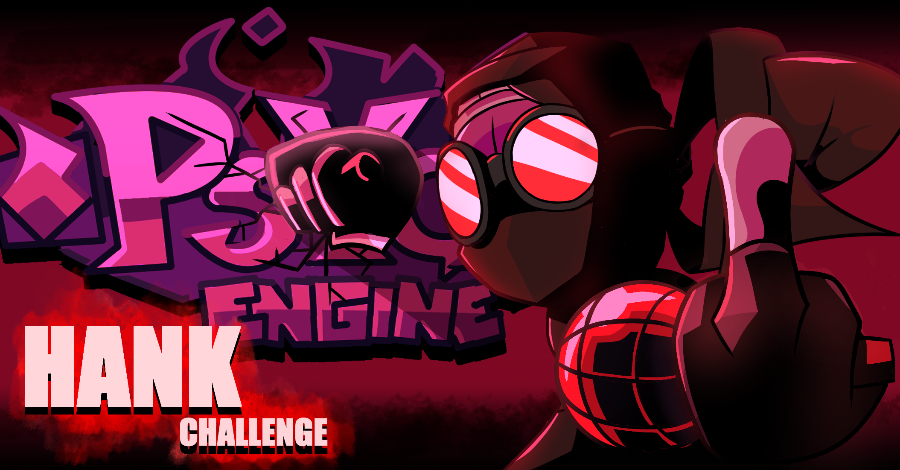

# FNF ONLINE VS. Hank Challenge - Psych Engine Port
This is a Psych Engine port of the first challenge in FNF ONLINE VS, the Hank Challenge (with the song's name being "Accelerant").

> [!IMPORTANT]  
> This port is intended to be used with the [ONLINE VS. Result Screen Port]().

A lot of people have already tried to port this challenge to psych, but most of these ports are rushed, inaccurate, and just stupidly lazy (written before [TheConcealedCow](https://gamebanana.com/members/1739194) made [his port](https://gamebanana.com/mods/440933), which is very good as well and is definitly worth your time). In this port, however, I tried to put as much effort as I can and I wanted this port to be one of the best psych engine ports to date. I hope you'll enjoy this port as much as I enjoyed making it!

## The Process (2022)

You are probably going to be shocked by this, but I started working on this port approximately ONE YEAR AGO (as of writing this). I was mostly inspired by how the shaggy mod was ported to psych engine at the time and I wanted to give accelerant a similar treatment, but I didn't have much experience with making FNF mods at the time, which explains why this port took so long to make. I learned SO MUCH about programming this year that it's literally INSANE. Programming was always a thing I liked to do, but now after I learned more about it, I have a completely different perspective on it that just makes me want to learn even more!

## A Special Thanks To The Psych Engine Devs (2022)

As a person who worked on a serious project (this one) with psych engine and saw it evolve throughout this year(2021-2022), I have a lot of respect for the people who work on psych engine and I know for certain that this port wouldn't have been the same without all of the features that have been added and without the Lua API that was released just the day after I had the idea to make this port. I want to thank all of the psych engine devs, and ESPECIALLY Shadow Mario, for making psych engine what it is today!

## Tips For Porters (2022)

> [!NOTE]
> 2024 Note:
> 
> I wrote this a long time ago, but the tips are very general and they don't involve any API-specific suggestions, so they're still relevant today.
> 
> I do think that in retrospective it was a bit irrelevant and kind of cringe to have these tips here, but they're good tips I guess, so I'll keep them here. Why not.

One of my objectives in making a well-coded and accurate psych engine port is to help other porters make better psych engine ports. There are many people who want to make good psych engine ports of other mods and don't have enough knowledge to make them actually good, and I want to help them. I made many comments in my code that will probably help others understand what the code does and its algorithm. In addition, I also put comments that give tips and suggestions for how to do certain things in the right way, and I also want to give some general tips right now.

My first tip is more programming related, and it's to understand what is happening in the source code when you write your code in Lua. This kind of skill is very important to gain with every tool you use to make something, ESPECIALLY with psych engine. Don't just assume the functions you use work as you think, and Instead, go to FunkinLua.hx and check exactly what the functions you use do, and how they affect the game as a whole. Furthermore, This skill of being able to read the source code will also help you solve problems and bugs you face along the way and you'll be able to go to the source code and try to understand what is causing the problem instead of attempting a lot of stuff for no reason. So if you thought you don't need to understand the source code to make a psych engine lua mod, then think again! Also, just to be clear, I don't know everything about Haxe and I never went out of my way to learn specifically about Haxe, but I know that if I ever face a problem in my code that I don't know how to fix, that's the reason why, and in this situation, I would go to learn specifically about everything that might be related to the problem, 
in the goal of understanding what's causing it. with that being said, I still think learning as much as you can will help you a lot and I hope to do it myself soon. I also want to mention that I don't recommend using the psych engine wiki, because it's very outdated and doesn't get updates anymore.

My second tip is more about how I made the port accurate, and no, there's no magic trick. making something accurate takes a lot of patience, and if you want to make something accurate, you'll need a lot of patience, BUT because I know not everyone has this much patience, I don't think that every port should be as accurate as this one. I think you should at least use the original version as a guideline and not just put sprites or set tween eases to whatever looks fine to you. I should also point out that if something looks broken because you tried to make it accurate, you should make it look good instead of making it accurate. balancing between making things accurate and making things good is the right way to make a port in my opinion.

My third tip is very simple, and it's to learn Lua properly. Luckily for you, there's a really good website that can help you with this. Here's the link:  https://www.lua.org/pil/contents.html

## Feedback

If you have something to say about the port or find a bug or any other problem with the port, please leave feedback in the comments of the mod's GameBanana page. I want this port to be the best it can be, and feedback will help with that a lot. Even if you think something I said in the comments (the comments in the code) is incorrect or wrong in some way, feel free to correct me. Even if you think the port is not accurate enough or not coded well enough and can explain why, I will be happy to hear you.

## Future Plans

Here are some of the major things that will be added in future updates:

1. FNF ONLINE VS. Result Screen Recreation ([DONE](), except for UMM support, which is generally canceled):

A full recreation of the result screen that appears in FNF ONLINE VS, which will also work with UMM on multiplayer and will also allow the unlock screen.
		
2. hank-player and maghank-player (Low priority, I'll do it when I have time):

A proper hank and maghank players with miss animations, game-over animations and any other animation that a player character in FNF usually has. These will also come in the form of UMM Custom characters.

## Accelerant REDUX

The offical remix (by philiplol) for Accelerant, "Accelerant REDUX", is playable in this port as an unlockable song. It includes the new song with one difficulty ("madness"), and a few minor visual effects added. This was originally supposed to only be a preview for a full Accelerant REDUX mod, which would have had completely new visuals, animations and cutscenes, a "normal" difficulty and a few new mechanics, but I completely canceled it.

## Thank you for reading the README file and thank you for playing this port!!

# Credits:

## Original Hank Challenge Credits:

* TheBlueHatted - Original Programmer & Additional Assets
* FifLeo - Lead Artist
* Philiplol - Musician
* Banbuds - Additional Assets & Extra Vocals

## Psych Engine Team:

* Shadow Mario - Engine Developer
* riveren - Arts and Animations

## Additional Credits:

* KevinKuntz - Made The Original VS. Ready script
* Teniente Mantequilla - Creator of the Unnamed Multiplayer Mod
